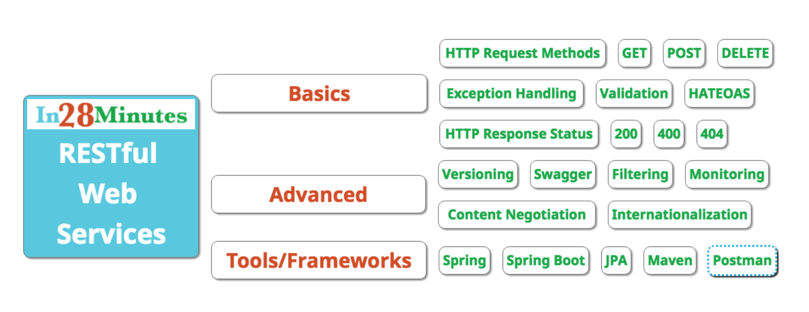

# Microservices Tutorial

[Udemy Course Link](https://www.udemy.com/course/microservices-with-spring-boot-and-spring-cloud/?couponCode=UPGRADE02223)

# Web Service

> **Definition : ** Software system designed to support interoperable machine-to-machine interaction over a network.

- **3 Keys of Web Service** 

  - Designed for machine-to-machine (or application-to-application) interaction 

  - Should be interoperable - Not platform dependent. As it shouldn't matter which language our web service made i.e. Java, PHP, .Net etc.

  - Should allow communication over a network

- How does data exchange between applications take place?

  - By Request and Response

- How can we make web services platform independent?

  - There are 2 popular formats widely accepted by most of frontend and backend languages - **XML** and **JSON**

**Transport** - It defines how a service is called. 

- HTTP - Is the service exposed over the internet,

- MQ - Is the service exposed over a queue

  